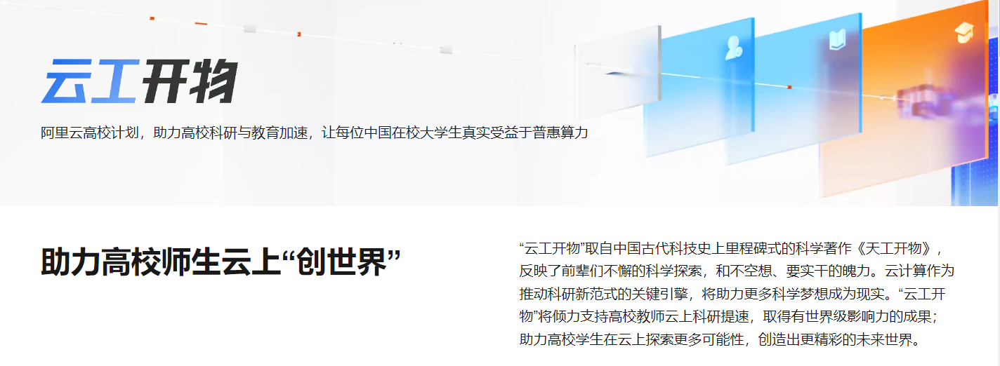
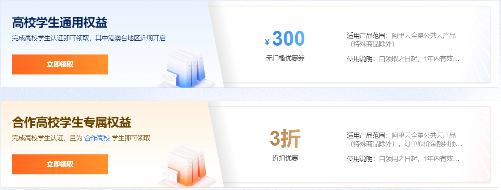
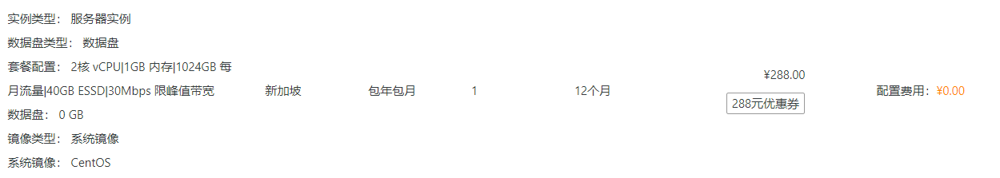
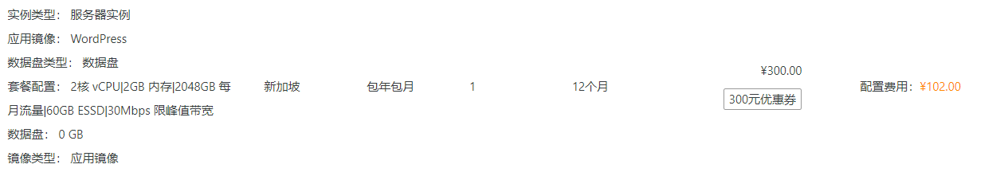
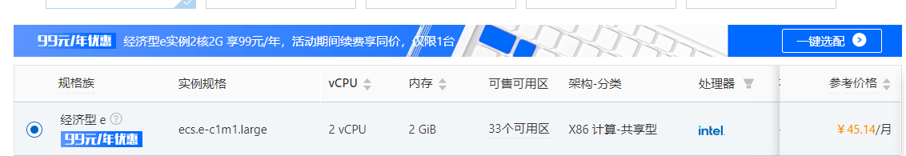

+++
title = "阿里云高校计划——云工开物：大学生 300 元无门槛代金券白嫖与避坑指南"
date = 2023-11-11
description = "阿里云针对高校学生推出了“云工开物”计划，通过支付宝认证的大学生，每年可以免费领取 300 元的无门槛代金券。无论是用来建博客、做测试还是跑脚本都非常香。本文记录了详细的申请流程与避坑指南。"
categories = ["VPS"]
tags = ["阿里云", "优惠", "服务器"]
+++

> **摘要**：阿里云针对高校学生推出了“云工开物”计划，通过学信网/支付宝认证的大学生，每年可以免费领取 300 元无门槛代金券。无论是用来建博客、做测试、跑脚本，还是部署个人项目，都非常香。本文提供最全的申请流程、选购建议与避坑案列。

## 什么是“云工开物”？

“云工开物”是阿里云专门为中国大陆地区高校学生（专科、本科、硕士、博士）推出的一项普惠计划。只要你是在校生，完成学生认证后，**每年都能领取一张 300 元无门槛代金券**。

这 300 元可以用于购买阿里云的绝大多数计算资源，如 ECS 云服务器、轻量应用服务器、OSS 对象存储等。

## 申请条件与准备

1. **阿里云账号**：建议使用已绑定手机的邮箱注册，支持支付宝一键登录。
2. **实名认证**：需中国大陆身份证实名，完成后可在控制台验证状态。
3. **学生认证**：支持支付宝学生认证或学信网验证，通常审核秒过、最多 1 个工作日。

## 详细申请步骤

### 第一步：登录并进入活动页面
访问[阿里云官网](https://www.aliyun.com)，搜索“**云工开物**”或直接打开[高校计划主页](https://university.aliyun.com/)（建议先收藏，页面常有秒杀入口）。

### 第二步：完成实名与学生认证
- 建议优先选择 **支付宝快捷认证**，通过手机号 + 学籍信息快速验证。
- 实名后在“学生福利”页面选择“学生认证”，系统将跳转至支付宝/学信网授权页，授权后通常秒过，最多 24 小时。

### 第三步：领取 300 元代金券
认证通过后返回活动页，点击“立即领取”按钮即可。若出现“可用券不足”，可先在“优惠券/代金券”中查看是否已有历史未使用券。

> ⚠️ **必看注意点：**
> * **有效期**：从领取日起算 **1 年**，到期不自动延长。建议在 30 天内至少使用 1 次，实现不浪费。
> * **可重复性**：只要你仍处于在校身份，**每年均可再领**。例如：2024 年 12 月可再次领取 300 元券。
> * **地域与产品限制**：优惠券可用于多数计算类产品（如 ECS、轻量应用服务器、OSS），但**不支持海外续费**、不支持域名、SSL 证书、云市场应用等非计算类服务。

---

## 购买建议

### 选项一：0 元购轻量应用服务器（海外免备案）
**配置**：2C1G，30M 带宽，40G 硬盘，1024G 流量/月

- **亮点**：免备案、带宽大、适合做测试环境、短期项目或个人博客。推荐给想快速上机的同学。
- **网络建议**：南方用户优先选香港（连国内更稳定）；北方可试新加坡、韩国线路。
- **购买入口**：
  - [香港（可抢）](https://common-buy.aliyun.com/?commodityCode=swas&request={%22ord_time%22:%2212:Month%22,%22order_num%22:1}&regionId=cn-hongkong)
  - [新加坡](https://common-buy.aliyun.com/?commodityCode=swas&request=%257B%2522regionId%3Dcn-hongkong&regionId=ap-southeast-1)

### 选项二：102 元轻量应用服务器（高配首选）
**配置**：2C2G，30M 带宽，60G 硬盘，2048G 流量/月

- **亮点**：内存翻倍、性能稳，适合长期运行中小应用（如个人博客、API 服务）。
- **实操建议**：用 300 元券抵扣，实际成本约 102 元/年，续费时优先同等配置再叠券（若券可用）。
- **购买入口**：
  - [香港](https://common-buy.aliyun.com/?commodityCode=swas&request=%257B%2522regionId%3Dcn-hongkong&regionId=cn-hongkong)
  - [新加坡](https://common-buy.aliyun.com/?commodityCode=swas&request=%257B%2522regionId%3Dcn-hongkong&regionId=ap-southeast-1)

### 选项三：99 元/年特价 ECS（国内稳定款）
**配置**：2C2G，3M 带宽，40G 硬盘（国内可用区）

- **注意**：此套餐为固定特价，通常不支持学生 300 元券（但价格非常低，适合不想频繁搬迁的项目）。
- **推荐人群**：准备做长期内容类网站、需要备案的项目，或对延迟友好的软件服务。
- **购买入口**：[活动页查看](https://www.aliyun.com/daily-act/ecs/99program)

---

## 常见问题与避坑指南 (Q&A)

**Q：代金券能用来买域名吗？**
A：**不能**。学生代金券主要用于计算资源（例如 ECS、轻量应用、OSS），不支持域名、SSL、云市场应用等。域名可以使用自己的预算购买，或等待阿里云域名活动（如首年 9.9 元）。

**Q：服务器到期后续费怎么办？**
A：直接续费成本高，因此最稳妥的策略是**用新年的 300 元券购买新机**，再手动迁移数据（Rsync、备份/恢复）。如果已有稳定业务且不方便迁移，可先保留当前机，再后续逐步迁移。

**Q：海外服务器能一直白嫖吗？**
A：目前新券不支持海外续费，意味着只能“以换代续”。想要长线稳定运行建议：
- 国内机 + 备案（适合内部项目和个人博客）
- 海外机若对全球访问需求高，可用作备用或阶段测试

**Q：如何避免导致优惠券被回收？**
A：避免违规操作，如搭建翻墙节点、滥用账号间转移资源；保持学生身份真实有效，遵守阿里云用户协议。
---

> 🎉 **总结**：“云工开物”是学生党不可错过的福利。无论你是想练手 Linux 操作，还是想搭建专属的个人博客，这 300 元代金券都是最好的起步资金。