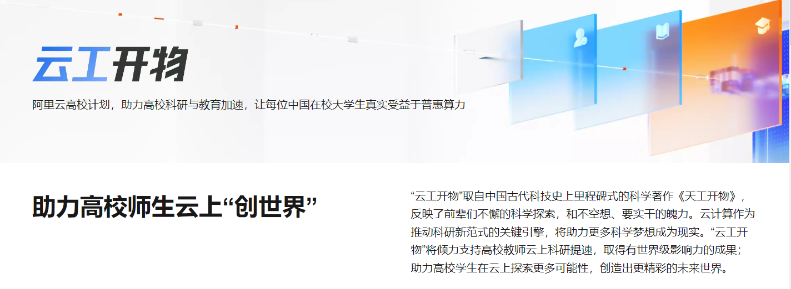
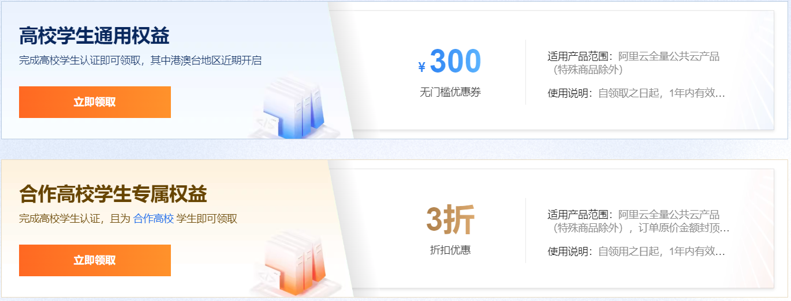
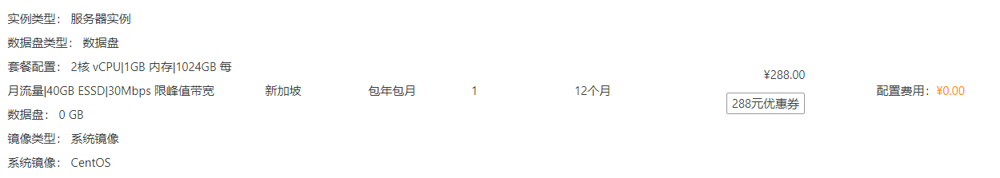
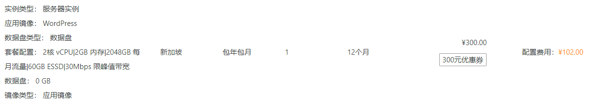
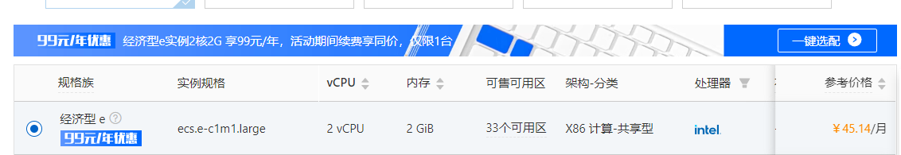

+++
title = "阿里云高校计划——云工开物：大学生 300 元无门槛代金券申领与避坑指南"
date = 2023-11-11
description = "详解阿里云“云工开物”大学生 300 元年度无门槛代金券申领流程，涵盖轻量香港/新加坡实例选购策略、长期无痛迁移方案及常见避坑技巧。"
categories = ["VPS"]
tags = ["阿里云", "服务器", "运维", "Linux"]
+++

> **摘要**：阿里云针对高校专科、本科、硕博研究生推出了“云工开物”高校计划。通过学信网或支付宝学籍认证后，在校期间每年均可申领一张 300 元无门槛代金券。本文梳理最新的认证领券逻辑、主流配置性价比对比及数据低成本平滑迁移方案。

## 什么是“云工开物”计划？

“云工开物”是阿里云面向中国大陆高校在读学生推出的普惠算力扶持项目。主要核心机制如下：

* **无门槛抵扣**：面额 300 元，支持抵扣符合条件的 ECS 云服务器、轻量应用服务器（SWAS）及对象存储（OSS）等基础计算资源。
* **按年滚动发放**：并非一次性权益。只要学信网状态处于“在读”，每个自然年（或上一张券到期后）可再次认证申领。
* **适用范围限制**：代金券仅限抵扣纯计算资源账单，不可用于购买域名、SSL 证书、云市场第三方镜像或短信包等附加产品。

---

## 申请条件与准备工作

在发起申领前，请提前备妥以下账号环境与资质材料：

1. **阿里云账号**：需完成个人大陆身份证实名认证（建议直接使用手机号或绑定实名支付宝快捷登录）。
2. **在校学籍凭证**：
   * **支付宝学生认证**：适合学信网信息变动同步较快的高校，系统自动调取，通常秒级完成。
   * **学信网在线验证码**：如支付宝快捷核验未通过，需前往学信网申请《教育部学籍在线验证报告》，提取 16 位或 24 位在线验证码供人工/接口核验。

---

## 详细申领流程

### 第一步：访问权益入口
登录阿里云官网，进入[阿里云高校计划（云工开物）主页](https://university.aliyun.com/)。建议将该主页加入书签，便于后续查验每年的续领资格与学生专属秒杀活动。



### 第二步：完成学生资质核验
进入控制台的“个人中心 - 认证管理”，找到“学生认证”模块：
1. 优先选择 **支付宝授权快捷认证**，系统会自动读取学籍状态。
2. 若提示学校名称不匹配或未在籍，请切换至 **学信网验证码认证**，填写真实入学年份、学历层次及学籍验证报告码。
3. 审核通过后，账号标签将变更为“高校在校生”。

### 第三步：领取 300 元无门槛券
回到“云工开物”活动页面，在学生专享福利区点击“立即领取”：
* 领券后可前往“费用中心 - 代金券管理”查看卡券状态与有效期。
* 券面有效期为自领取之日起 **365 天**，不可转赠、不折现、逾期自动失效。



---

## 硬件选购方案与横向对比

如何合理规划这 300 元额度，决定了服务器的使用寿命与稳定性。以下汇总了学生群体最常见的采购策略：

| 推荐方案 | 规格配置 | 官网常规价 | 券后实付 | 核心优势 | 潜在瓶颈 | 推荐业务场景 |
| :--- | :--- | :--- | :--- | :--- | :--- | :--- |
| **方案 A：海外轻量（免备案）** | 2核CPU / 1G内存<br>30Mbps 峰值<br>40G SSD / 1TB 月流量 | 约 288~300 元/年 | **0 元/年** | 免 ICP 备案，大带宽，即开即用 | 1G 内存偏小，跑重载应用易 OOM | 个人博客、静态页面、API 调试、轻量脚本 |
| **方案 B：高配轻量（进阶版）** | 2核CPU / 2G内存<br>30Mbps 峰值<br>60G SSD / 2TB 月流量 | 约 402 元/年 | **约 102 元/年** | 内存充足，支持多容器共存，网络吞吐高 | 需少量自费，次年无法直接叠券原价续费 | Docker 容器、多站点同开、轻量后端应用 |
| **方案 C：国内特价 ECS** | 2核CPU / 2G内存<br>3Mbps 固定带宽<br>40G ESSD Entry 盘 | 99 元/年（固定特价） | **99 元/年**<br>*(通常不吃券)* | 国内机房延迟低，特价可享长效续费 | 带宽受限（3M），建站必须完成国内域名备案 | 长期国内备案建站、稳定 API、学习 Linux 生产环境 |

### 方案深度解析与选购建议

#### 1. 方案 A：0 元无痛入手（轻量应用服务器 - 中国香港 / 新加坡）
* **网络与线路考量**：南方电信/联通网络访问香港可用区延迟表现较好（约 30~50ms）；北方及移动宽带用户可酌情选择新加坡或韩国可用区。
* **内存优化技巧**：由于实例仅有 1GB 内存，部署 Linux 后建议立即配置 2GB 的虚拟内存（Swap），以防止部署 Docker、MySQL 或编译安装工具时触发 OOM Killer 杀掉关键进程：

```bash
# 创建 2GB Swap 文件并启用
sudo fallocate -l 2G /swapfile
sudo chmod 600 /swapfile
sudo mkswap /swapfile
sudo swapon /swapfile
echo '/swapfile none swap sw 0 0' | sudo tee -a /etc/fstab
```

* **直达入口**：
  * [香港地域轻量服务器抢购](https://common-buy.aliyun.com/?commodityCode=swas&request={%22ord_time%22:%2212:Month%22,%22order_num%22:1}&regionId=cn-hongkong)
  * [新加坡地域轻量服务器抢购](https://common-buy.aliyun.com/?commodityCode=swas&request=%257B%2522regionId%3Dcn-hongkong&regionId=ap-southeast-1)



#### 2. 方案 B：自费 102 元换取性能富余（2C2G 规格）
* 相比 1G 内存机型，2G 内存可流畅运行现代轻量运维面板、自建 Git 节点或小型博客程序，且具备 2048GB/月的宽裕下行流量。
* 适合预算可接受每年百元出头、不想把时间浪费在抠内存优化的开发者。



#### 3. 方案 C：长周期生产用途（99 元/年 ECS 经济型 e 实例）
* **架构差异**：ECS 属于标准 IaaS 层产品，支持挂载多块云盘、自定义虚拟私有网络（VPC）与弹性公网 IP（EIP），生态扩展性优于轻量应用服务器。
* **关于代金券**：该活动机型为官方特价通道，若系统结算页面不支持选用学生 300 元券，可直接使用微信/支付宝自费付 99 元拿下，学生代金券则可留作购买 OSS 存储或搭建其他临时算力环境。
* **购买入口**：[阿里云金秋/年度 99 元特惠页](https://www.aliyun.com/daily-act/ecs/99program)



---

## 常见问题与运维避坑指南 (Q&A)

### Q1：为什么下单结算时显示无法使用学生代金券？
* **品类不匹配**：代金券限定购买特定计算产品，如购物车中掺杂了域名、商标、云市场镜像费、未包含在内的弹性公网 IP 保障费，会导致整单不满足抵扣条件。
* **海外续费策略变动**：目前阿里云已限制使用学生券对部分非大陆可用区实例直接续费。结算时如无法勾选，需在新一周期申领新券、开辟全新实例后执行迁移。

### Q2：“以换代续”模式下，如何快速平滑迁移老服务器数据？
由于海外轻量服务器通常无法直接低成本续费，每到一年期满，推荐采用“开新机 -> 镜像/数据迁移 -> 解析切换”的规范化迁移方案：

1. **静态数据快速同步**：两台服务器之间使用 `rsync` 工具走加密通道同步，速度通常远快于本地下载再上传：

```bash
# 在新服务器上执行，拉取旧服务器 Web 根目录数据
rsync -avzP -e 'ssh -p 22' root@old_server_ip:/www/wwwroot/ /www/wwwroot/
```

2. **数据库冷热备份**：使用导出工具做原子性备份，切勿直接拷贝热运行的数据库底层数据文件：

```bash
# 旧机器导出 SQL
mysqldump -u root -p --all-databases > all_databases.sql
# 传输至新机器后导入
mysql -u root -p < all_databases.sql
```

3. **DNS 平滑割接**：将域名的 A 记录解析 TTL 值提前 24 小时缩短至 60 秒，待新机部署测试无误后，直接更新 IP 指向，实现访客无感切换。

### Q3：海外轻量服务器有何网络合规风控？
* 阿里云海外可用区（香港、新加坡等）在大陆方向设立了严格的流量审计规则。严禁搭建代理、网络穿透类越界工具或对外发起网络扫描。
* 一旦触发网络安全审查，相关端口将被黑洞路由牵引，严重者将直接封禁公网 IP 并追溯实名账号，导致在校学生身份被列入风险名单，影响后续学年福利的领取。

### Q4：代金券买完服务器剩下的几十元怎么用？
* 建议搭配购买 **OSS 对象存储资源包**（如 40GB/年 的标准存储包，单价通常十多元）。
* 将博客的图床、静态资源文件、每日备份归档挂载至 OSS，减轻轻量服务器本地磁盘磨损与备份压力，充分榨干 300 元代金券的面额价值。