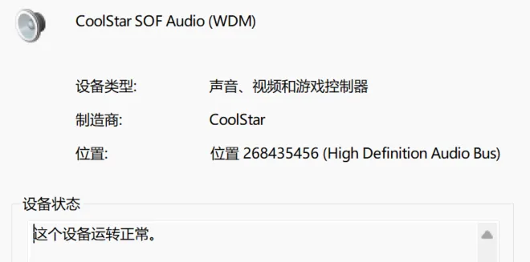
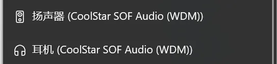
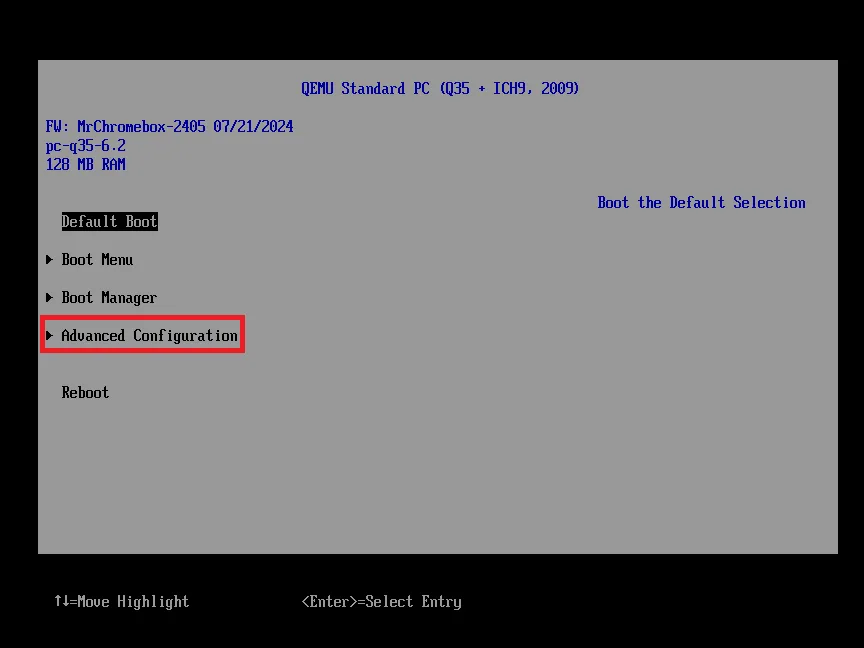
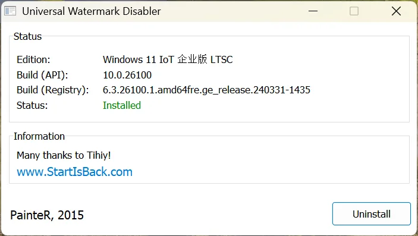
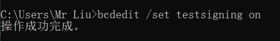

+++
title = "Chromebook刷Windows后安装声卡驱动"
date = 2024-12-28
description = "在 Chromebook 刷 Windows 后，教你安装 Coolstar 声卡驱动的完整流程，含 BIOS 设置、UWD 与 Type-C 驱动步骤。"
categories = ["Chromebook", "教程"]
tags = ["Chromebook", "Windows", "驱动"]
+++

## 文章概述

Chromebook 刷 Windows 后最常见的问题是**声卡无法识别**，导致无法发声。这是因为 Chromebook 原生采用 ARM 或特殊的 x86 硬件，Windows 官方未适配其驱动。幸运的是，开源社区中的 Coolstar 团队提供了免费的音频驱动解决方案。本文将逐步教你如何安装这个驱动，恢复声卡功能。

## 为什么 Chromebook 需要安装驱动？

### Chromebook 硬件的特殊性

Chromebook 原生使用 Chrome OS，期间配套的音频芯片（通常是 Intel HDA 或高端��片）缺乏标准 Windows 驱动。刷 Windows 后，系统无法自动识别这些硬件，甚至被分类为"未知设备"。

### Windows 官方不支持

由于 Chromebook 是小众设备，微软官方不会为其开发驱动。因此需要借助第三方社区（如 Coolstar）的努力，通过破解与适配来实现兼容。

### 关键步骤概览

- **关闭安全启动** → 允许加载未签名驱动
- **安装 UWD（Universal Windows Driver 基础框架）** → 提供驱动运行环境
- **关闭驱动签名验证** → 使用破解驱动
- **安装声卡驱动** → 识别硬件并恢复音频功能

---

## 安装前的准备工作

### 系统与硬件要求

- **操作系统**：Windows 10 或 Windows 11（建议 22H2+）
- **权限**：管理员账户
- **磁盘空间**：至少 500MB 空闲空间
- **网络**：稳定网络连接（下载驱动包）
- **兼容设备**：主要支持 Intel 第 10-12 代 CPU 的 Chromebook（如 HP C1030、Lenovo 系列）

### 准备清单

- 获取管理员权限
- 备份重要数据
- 关闭杀毒软件（避免误报）
- 准备下载驱动文件
- 留足安装时间（整个过程可能需要 20-30 分钟）

---

## 完整安装教程

### 预览安装效果

先上一个安装好后的样子：




### 第一步：进入 BIOS 并关闭安全启动

1. 关机后重启，进入 BIOS 界面（通常按 `ESC` 或 `DEL` 或 `F2`）
2. 找到 **Advanced Configuration** 或 **Security** 选项
3. 定位 **Secure Boot**（安全启动）选项，将其设置为 **Disabled**（禁用）
4. 保存并退出

关闭安全启动的目的是允许 Windows 加载未签名的驱动程序（破解驱动）。



### 第二步：获取并准备驱动文件

1. 下载驱动包：[下载地址](https://down.mrliu1024.top/download/Chromebook/Chroembook%E5%A3%B0%E5%8D%A1%E9%9B%B7%E7%94%B5%E9%A9%B1%E5%8A%A8_%E9%80%82%E7%94%A8%E4%BA%8E%E8%8B%B1%E7%89%B9%E5%B0%9410-12%E4%BB%A3CPU.zip)
2. 若杀毒软件报毒，请**暂时关闭杀毒软件**再下载（这是假报，驱动本身安全）
3. 解压到易于访问的位置（例如桌面或 `C:\Drivers\`）

### 第三步：安装 UWD（通用 Windows 驱动框架）

UWD 是驱动程序的运行基础框架，必须先安装。

1. 打开解压后的驱动文件夹
2. 找到 **UWD** 相关的安装程序，双击运行
3. 按照安装向导完成安装（**过程中需要重启计算机**）
4. 重启后，打开驱动包验证安装效果（应显示类似下图）：



### 第四步：安装声卡驱动程序

1. 打开驱动包中的 **Coolstar-audio-driver** 安装程序
2. 点击"安装"按钮
3. 若出现报错，**无需紧张**，试试以下方法：
   - 再试几次（重复点击安装，有时网络波动导致）
   - 检查是否以管理员身份运行
   - 确保已关闭杀毒软件和防火墙

### 第五步：卸载冲突驱动

在安装破解驱动前，必须删除系统中的冲突驱动：

1. 打开 **控制面板** → **程序和功能**（或 **设置** → **应用** → **应用和功能**）
2. 查找以下两个驱动，逐一卸载：
   - `csaudiointsof`
   - `sklhdaudbus`
3. 卸载时会提示重启，**暂时先不重启**，继续后续步骤

### 第六步：关闭驱动签名验证

这一步很关键，关闭签名验证才能加载破解驱动。

1. **以管理员身份**打开"命令提示符"或"PowerShell"
   - 按 `Win + X`，选择 **Windows Terminal (Admin)** 或 **Command Prompt (Admin)**
2. 复制以下命令并粘贴，然后按 `Enter`：
   ```sh
   bcdedit /set testsigning on
   ```
3. 若操作成功，会显示：
   ```
   操作成功完成。
   ```



> ⚠️ **重要**：如果显示权限错误，请确认是以管理员身份打开的命令行工具。

### 第七步：安装破解声卡驱动

1. 返回驱动文件夹，找到 **"声卡破解"** 或 **"Audio Driver"** 文件夹
2. 其中包含两个 `.inf` 文件：
   - `csaudiointcsof.inf`
   - `csaudiointcsof.inf`（注：两个文件名可能相同，均需安装）
3. **右键点击第一个文件** → **安装驱动程序**
4. 按照提示完成安装
5. **重复**对第二个文件执行相同操作
6. 安装完成后**重启计算机**

### 第八步：安装 Type-C / 雷电驱动（可选）

如果你的 Chromebook 支持 Type-C 或 Thunderbolt 连接，可选择安装：

1. 打开驱动文件夹中的 **"Type-C 驱动"** 子目录
2. 找到以下两个 `.inf` 文件：
   - `inteltcss.inf`
   - `intelpmc.inf`
3. 分别右键安装（步骤同第七步）
4. 根据 BIOS 提示重启（如果有）

> **注意**：我测试的 HP C1030 不支持雷电，所以 Type-C 驱动可用性因设备而异。建议先安装音频驱动，若 Type-C 需要再补装。

---

## 常见问题排查

### 问题 1：安装后仍无声音

**症状**：设备管理器已识别声卡，但播放无声

**解决方案**：
1. 打开 **设备管理器**（`Win + X` → 设备管理器）
2. 展开 **音频输入和输出**，查看声卡状态
3. 若显示 ❌（设备错误），查看详细错误代码
4. 常见错误与解决：
   - **代码 10（STATUS_DEVICE_POWER_FAILURE）**：驱动加载失败，重启即可
   - **其他错误**：更新 BIOS 或尝试重装驱动

### 问题 2：显示"许可证冲突"错误

**症状**：安装驱动时提示 `{许可证冲突} 系统检测到你的注册产品类型有篡改现象`

**原因**：驱动签名验证未正确关闭

**解决方案**：
1. 重新执行**第六步**的命令
2. 使用 PowerShell 验证状态：
   ```powershell
   bcdedit /enum | grep testsigning
   ```
   应显示 `testsigning Yes`
3. 若未生效，尝试重启后重新执行第六步

### 问题 3：杀毒软件阻止驱动安装

**症状**：安装时被 Windows Defender 或其他杀毒软件中断

**解决方案**：
1. **临时关闭**杀毒软件（完成安装后再开启）
2. 如果是 Windows Defender，可在"病毒和威胁防护"中添加驱动文件夹为例外
3. 重新尝试安装驱动

### 问题 4：无法进入 BIOS

**症状**：按 ESC / F2 / DEL 等都进不了 BIOS

**解决方案**：
- 不同品牌 Chromebook 快捷键不同，常见的有：
  - **HP**：`ESC` 或 `F10`
  - **Lenovo**：`F1` 或 `DEL`
  - **ASUS**：`F2` 或 `DEL`
  - **Dell**：`F2` 或 `F12`
- 可查阅你的 Chromebook 型号对应的用户手册

---

## 重要注意事项与风险提示

### ⚠️ 关键警告

1. **驱动签名关闭的安全性**：关闭签名验证会降低系统安全性，可能增加恶意驱动的风险。建议仅在必要时启用 Testsigning 模式，安装完成后酌情启用回来。
2. **不可逆操作**：更改 BIOS 设置后，如果刷回 Chrome OS，部分定制参数可能丢失。
3. **系统损坏风险**：极少情况下，驱动冲突可能导致蓝屏或无法启动。建议先创建系统还原点。

### ✅ 最佳实践

1. **备份数据**：安装前备份重要文件
2. **创建系统还原点**：
   ```
   Win + R → rstrui.exe → 创建还原点
   ```
3. **迭代验证**：每完成一步骤，检查系统是否正常
4. **记录命令**：保存第六步的 `bcdedit` 命令，便于日后参考
5. **及时更新**：定期检查 Coolstar 官网是否发布新版驱动

### 📋 卸载驱动（若需要回滚）

如果需要卸载驱动并恢复原状：

```powershell
# 重新启用驱动签名验证
bcdedit /set testsigning off

# 在控制面板中卸载 Coolstar 驱动
# 设置 → 应用 → 应用和功能 → 搜索 Coolstar → 卸载
```

重启后即可恢复。

---

## 推荐配置与兼容性

### 已测试兼容设备

- ✅ **HP C1030**：完美支持（部分型号音频效果最佳）
- ✅ **Lenovo Yoga Chromebook**：支持
- ✅ **ASUS Chromebook**：大多数型号支持
- ❓ **Dell Chromebook**：需自行验证

### 处理器代数支持

驱动包主要适配 **Intel 第 10-12 代 CPU** 的 Chromebook：
- Intel Core i3/i5/i7 10 代及以上
- Intel Pentium/Celeron N5000/N6000 系列

### 音质表现

| 驱动版本 | 音质等级 | 备注 |
|---------|--------|------|
| 最新版  | ⭐⭐⭐⭐ | 支持立体声和环绕音 |
| 旧版本  | ⭐⭐⭐   | 基础音频功能 |

---

## 总结与后续

### 你现在已拥有

✅ 正常的音频输出  
✅ 可以播放视频、音乐  
✅ 支持在线会议音频  
✅ 系统声音提示恢复  

### 后续可尝试

- 调整音量和音频设置（设置 → 声音）
- 安装音频增强程序（如 Equalizer APO）
- 定期检查驱动更新

### 获取帮助

如果遇到仍未解决的问题：

1. **查阅 Coolstar 官网**：[https://coolstar.org/chromebook/](https://coolstar.org/chromebook/driverlicense/login.html)
2. **搜索社区讨论**：在 Reddit 的 r/Chromebook 提问
3. **本文反馈**：在评论区分享你的设备型号和问题描述

---

## 致谢

> **感谢** Coolstar 团队以及所有无偿分享驱动文件与技术支持的开源社区贡献者。  
> 本文分享仅供学习和测试之用，若需商用或解除署名限制，请前往 [Coolstar 官网](https://coolstar.org/chromebook/driverlicense/login.html) 获取正版支持。

---