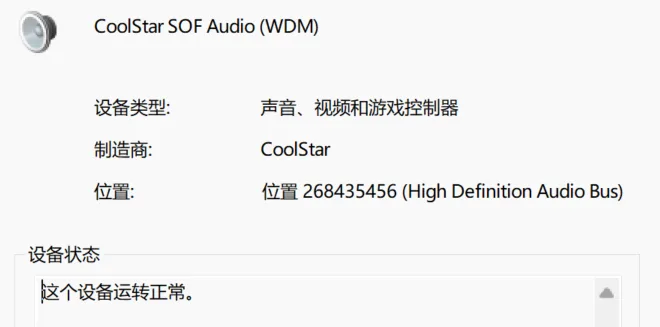
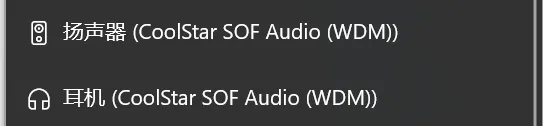
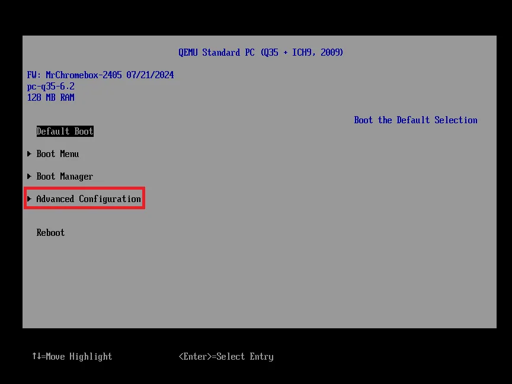
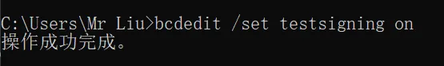
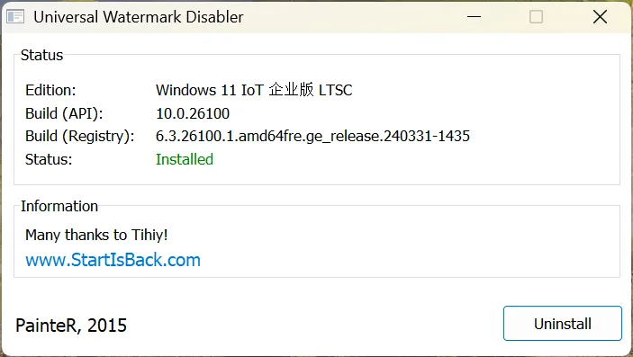

+++
title = "Chromebook 刷 Windows 后安装 Coolstar 声卡驱动与避坑指南"
date = 2024-12-28
description = "详解 Chromebook 改装 Windows 10/11 后解决无声问题的完整方案，涵盖 Tianocore EDK2 固件调优、Testsigning 签名绕过、UWD 框架部署与音频总线 INF 手动注入。"
categories = ["Chromebook", "教程"]
tags = ["Chromebook", "Windows", "驱动", "Coolstar", "硬件改装"]
+++

> **摘要**：通过 MrChromebox 等固件将 Chromebook 刷入完整 UEFI 并安装 Windows 后，声卡失效是最普遍的痛点。本文深入剖析 ChromeOS 专有音频总线与 Windows 驱动架构冲突的底层根源，并提供禁用 Secure Boot、开启测试签名、部署 UWD 框架及手动注入 INF 驱动的完整实操与排错指南。

## 为什么改装 Windows 后声卡会失效？

Chromebook 原生运行的 ChromeOS 与传统 Windows PC 在音频架构设计上存在本质差异：

* **非标准音频总线拓扑**：传统 PC 多采用通用 Intel High Definition Audio (HDA) 标准，而现代 Chromebook 广泛采用轻量化、高集成的 **Intel SST (Smart Sound Technology)** 或 **MIPI SoundWire** 总线，音频编解码器（如 Realtek ALC5682、Maxim 98357A 等）直接挂载在 SOC 的 DSP 数字信号处理器上。
* **缺少微软通用 WHQL 驱动**：ChromeOS 依赖 Linux 内核中针对各主板代号（Board Overlay）定制的 ASoC 拓扑配置，微软官方更新库中并未包含此类 OEM 专用固件拓扑的签名驱动。
* **驱动签名冲突**：开发者 Coolstar 等社区团队逆向重构了总线通信并开发了第三方驱动，但因属于非 WHQL 商业签名的测试驱动，Windows 内核驱动强制签名机制（Driver Signature Enforcement）会默认拦截加载。

---

## 准备工作与前置环境

在正式安装驱动前，请务必确认以下软硬件环境满足要求：

* **系统版本**：Windows 10 / 11 64位（建议 22H2 及以上纯净原版系统，精简版可能精简了底层 AudioSrv 核心组件）。
* **固件状态**：设备必须已解除硬件写保护（CR50 / WP 电阻 / 电池断开），并通过 MrChromebox 刷入完整 UEFI（Tianocore EDK2 引导，开机为兔子标志）。
* **操作权限**：具备本地 Administrator 管理员权限。
* **安全软件临时策略**：安装全程需**暂时关闭 Windows Defender 实时保护**或第三方杀毒软件，避免注入内核级 `.sys` 时被误报拦截。
* **驱动包本地路径**：[高速分流下载地址](https://down.mrliu1024.top/download/Chromebook/Chroembook%E5%A3%B0%E5%8D%A1%E9%9B%B7%E7%94%B5%E9%A9%B1%E5%8A%A8_%E9%80%82%E7%94%A8%E4%BA%8E%E8%8B%B1%E7%89%B9%E5%B0%9410-12%E4%BB%A3CPU.zip)  
  *建议解压至纯英文短路径（如 `C:\Drivers\`），避免脚本在解析含空格或中文字符路径时抛出异常。*

---

## 安装效果预览

成功加载驱动并完成拓扑端点绑定后，“设备管理器”中将正确识别系统总线控制器及音频终端：




---

## 详细安装与配置步骤

### 第一步：进入 UEFI 固件关闭安全启动 (Secure Boot)

必须在底层彻底关闭 Secure Boot，否则 Windows 内核将拒绝切换至测试签名状态。

1. 冷机开机，在屏幕点亮且出现 Tianocore 兔子 Logo 瞬间，快速连续按 **ESC** 键（部分机型需按 **F2**）进入 BIOS/UEFI 菜单。
2. 使用键盘方向键导航至 **Device Manager** → **Secure Boot Configuration**。
3. 将 **Attempt Secure Boot** 选项更改为 **Disabled**（或取消勾选）。
4. 按 **F10** 保存变更，按 **ESC** 退出并引导进入 Windows。



### 第二步：常驻启用系统测试签名模式 (Testsigning)

Windows 默认强制启用内核驱动签名校验，加载非 WHQL 驱动必须打开 BCD 测试通道。

1. 右键点击“开始”菜单或按快捷键 Win + X，选择 **终端管理员** 或 **PowerShell (管理员)**。
2. 运行如下命令：

```cmd
bcdedit /set testsigning on
```

3. 终端返回“**操作成功完成**”即代表引导数据修改成功。



> ⚠️ **核心避坑机制**：
> * 重启后屏幕右下角展示“测试模式 (Test Mode)”水印属正常状态。
> * **切勿手动执行 `testsigning off`**。该驱动并不具备微软数字证书，一旦关闭测试通道，下次重启时驱动将直接被阻止运行，音频设备会再次离线。

### 第三步：彻底清理系统冲突与残留驱动

若系统先前通过 Windows Update 自动拉取了微软的通用兼容驱动，可能造成设备 ID 抢占：

1. 进入系统 **设置** → **应用** → **安装的应用**。
2. 检索并卸载包含以下名称开头的软件包：
   * `csaudiointsof`
   * `sklhdaudbus`
3. 卸载提示重启时，选择“稍后重启”，继续执行后续步骤。

### 第四步：部署 UWD (Universal Windows Driver) 基础框架

UWD 框架提供了驱动与系统音频服务交互的核心支持库。

1. 打开解压后的驱动目录，定位至 **UWD** 文件夹。
2. 右键点击安装程序，选择 **“以管理员身份运行”**。
3. 保持默认配置安装完成。
4. **安装完成后请立即重启一次系统**，确保底层支持服务完全装载。



### 第五步：运行 Coolstar 主驱动程序

1. 进入解压目录下的 **Coolstar-audio-driver** 安装程序目录。
2. 右键以管理员身份运行安装向导，点击 **Install** 进行注入。
3. 若弹出网络请求超时或脚本中断提示，请确认防病毒软件已退出，重试安装即可。

### 第六步：手动注入声卡 INF 设备描述文件

若主程序安装后系统仍显示“无音频输出设备”，需手动通过设备安装信息文件向系统注册端点：

1. 进入驱动包中的 **“声卡破解”**（或 **Audio Driver**）子目录。
2. 找到总线与音频端点的 `.inf` 配置文件