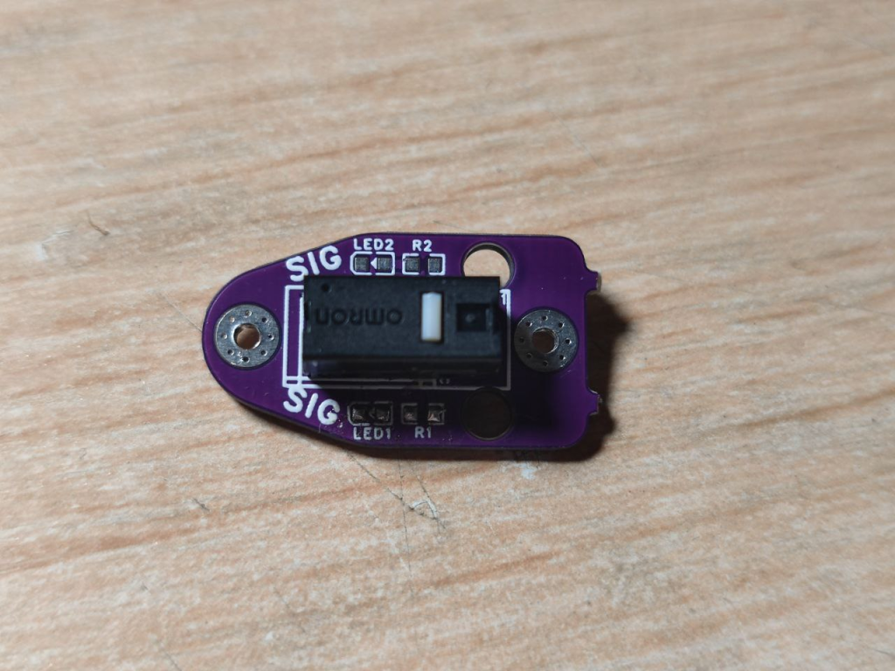

+++
title = "Klipper教程——自动调平：Euclid Probe组装与进阶配置指南"
date = 2023-11-21
description = "深入解析机械微动接触式探针 Euclid Probe 的硬件组装、电路焊装避坑点及 Klipper 自动化宏深度配置与排错方案。"
categories = ["3D打印", "教程"]
tags = ["Euclid Probe", "Klipper", "自动调平", "3D打印机DIY", "机械探针"]
+++

在消费级与 DIY 3D 打印领域，首层平整度（First Layer Squish）直接决定了打印的成败。随着打印尺寸提升至 300mm 以上，铝基热床在热应力下的马鞍形形变和局部翘曲往往达到 0.1~0.3mm 级别。手动四角调平只能校平平面倾角，无法消除微观凹凸。本文将从硬件制作到 Klipper 宏配置，全面拆解高性价比的机械触点探针方案——**Euclid Probe**。

## 自动调平技术概览与方案选型

### 自动调平的工作原理

自动调平（Auto Bed Leveling, ABL）的实质是**探针测量 + 算法网格构建 + Z轴动态补偿**：
1. **多点探测**：工具头移动至预设网格坐标阵列（如 5x5 或 9x9），Z 轴下压使探针触发，算法获取触发点的绝对高度。
2. **矩阵运算**：减去喷嘴相对探针的机械位移量（Z-Offset），拟合出热床形变表面网格（Bed Mesh）。
3. **实时补偿**：打印过程中，固件在解析 X/Y 插补运动的同时，驱动 Z 轴步进电机进行细微联动上下补偿，使喷嘴与弯曲床面始终保持恒定间隙。

### 探针主流方案横向对比

| 方案类别 | 代表型号 | 重复精度（Range） | 优点 | 缺点 / 局限性 | 综合成本 |
| :--- | :--- | :--- | :--- | :--- | :--- |
| **电磁微动式** | BLTouch / 3DTouch | 0.010 ~ 0.050mm | 安装简单、通用性强、无需拆卸 | 机械探针易弯折、磁干扰敏感、廉价仿品重复性极差 | 40 ~ 260元 |
| **电感/涡流式** | 接近开关 / Beacon / Cartographer | 0.001 ~ 0.005mm | 扫描速度极快、无机械磨损 | 受热床温度温漂影响、强依赖导电/导磁打印板 | 60 ~ 200元 |
| **磁吸机械式** | **Euclid / Klicky** | **< 0.005mm** | **精度极高、无温漂、不受打印板材质限制、成本极低** | **需要预留停靠坞空间（Dock）、需编写挂载宏** | **5 ~ 20元** |

通过实测对比，自制 Euclid 探针由于直接采用工业微动触发，其探针重复测试极差（Range）可轻松压制在 0.005mm 以内，完全杜绝了廉价 BLTouch 常见的随机高度漂移问题。

## Euclid Probe 硬件制作与组装

> **核心电气安全警告**：
> 焊接 PCB 时，必须短接板上的 **NC（常闭）** 焊点，切勿短接 **NO（常开）**！
> 
> *原理解析*：在常闭回路中，探针未触发时回路保持导通；探针撞击床面触发或探针从磁吸基座意外脱落时，回路均会瞬间断开。这种故障安全（Fail-Safe）设计能确保固件第一时间捕捉到“异常脱开”状态，避免撞床事故。

### 物料清单（BOM）

- **3D 打印结构件（3件）**：
  - 打印头安装支架（Toolhead Mount）
  - 探针母板固定座（Probe Carrier）
  - 龙门架/型材停靠坞（Dock Mount）
  - *推荐材料*：ABS、ASA 或 PETG（热端周围温升高，严禁使用 PLA）
- **电路板与电子元器件**：
  - Euclid 双面沉金 PCB（支持免费打样）
  - 欧姆龙超微型行程微动（如 D2F-L / D2F-01F）
  - XH2.54 3-Pin 直针/弯针座及配套线束
  - 0402 贴片电阻（510Ω）与贴片 LED（可选，用于工作状态指示）
- **紧固件与磁铁**：
  - $\Phi 6 \times 3 \text{ mm}$ 沉孔钕铁硼强磁铁（N52推荐）$\times 4$
  - $\text{M}2 \times 5 \text{ mm}$ 沉头螺钉（用于固定 PCB 与磁铁）$\times 4$
  - $\text{M}3 \times 10 \text{ mm}$ 内六角螺钉及型材船型螺母 $\times 2$

### 组装与焊接关键步骤

1. **磁铁极性标定**：将打印头端基座与探针端板对齐，在磁铁侧边做标记，确保对应吸合位的两个磁铁互为异性极吸合，杜绝相斥安装。
2. **沉头平整度处理**：锁紧 M2 螺钉时，螺钉头部必须完全没入磁铁沉孔内，螺钉露出平面会导致磁接触面间隙增大，造成阻抗变化和微小角度倾斜。
3. **焊接微动开关**：将微动引脚插入 PCB，焊接时烙铁温度建议控制在 $320^\circ\text{C}$，单脚焊接时间不超过 2 秒，防止微动内部簧片受热退火失效。



## Klipper配置

在[printer.cfg]中加入以下内容

```ini
#引入euclid.cfg
[include euclid.cfg]

#启用强制移动
[force_move]
enable_force_move: True

#指定响应类型和方法
[respond]
default_type: echo
default_prefix: echo:
```

在Klipper配置文件中新建euclid.cfg，填入以下内容

```ini
## 以下是示例配置，旨在指导您为自己的打印机配置 Euclid 探头。
##
## 将此配置与您的配置相结合时，请确保所有注释标记都以"@TODO "开头。 否则可能会损坏你的探针、打印机或你的自尊心。
##
##
## 本示例适用于固定基座、固定龙门/车架和移动床运动系统，如 RailCore、Ender5、V-Core3 等。Delta 打印机也类似
##
## 像 Voron 这样的移动龙门式打印机需要进行一些调整，以确保适当的间隙和水平程序；下面提供了一些提示。
##
## 阵列变量的实现和宏设置归功于 Brian Lalor，他是 Discord 上的 yolo-dubstep#8033。有关更新和详情，请参阅 https://github.com/blalor/vcore3-ratos-config。
##
## @TODO 以下是硬件配置的硬件探针配置。它可以出现在 printer.cfg 中，也可以出现在 euclid.cfg 中，但不能同时出现。
##更多详情，请参阅 https://euclidprobe.github.io/05_klipper.html。

#[probe]
## Euclid 探针在 Huvud 板上的引脚 ?? 上
#pin: !PE5
##y_offset: -27.5
#z_offset: 7.5
#speed: 5
#samples: 2
#samples_result: median
#sample_retract_dist: 5.0
#samples_tolerance: 0.05
#samples_tolerance_retries: 3
#lift_speed: 30


[gcode_macro EuclidProbe]
description: 查看Euclid probe挂载和归位的配置变量

## @TODO 替换坐标以适应您的打印机
variable_position_preflight: [  150, 30 ] # 工作准备位置
variable_position_side:      [  207, 30 ] # 挂载准备位置
variable_position_dock:      [  207, 0  ] # 停靠坞的坐标
## @TODO 如果您的打印机有固定的Z限位，请在此处定义
## @TODO 例如 Voron Trident
variable_position_zstop:     [ 150,250 ] #Z限位的位置

## 归位准备位置
variable_position_exit:      [ 150 , 0 ] #归位位置

## 工具头与打印床间高度差
variable_bed_clearance: 15

## probe dock height
## @TODO 如果工具头可以相对于测头基座高度垂直移动（例如连接到 Voron 2.4 等龙门架打印机上），则将其设置为测头基座的 Z 位置。
# variable_dock_height: 15

##移动速度mm/min
variable_move_speeds: 18000

## 内部状态变量；不用于配置！
variable_batch_mode_enabled: False
variable_probe_state: None

gcode:
	RESPOND TYPE=command MSG="{ printer['gcode_macro EuclidProbe'] }"

#归位是针对特定机器的。  
#本例适用于龙门架/移动床打印机，如 Rat Rig V-Core 3
#确保只在 Klipper 配置的一个位置（通常在此处或 printer.cfg）定义 [homing_override]
#尤其重要的是，在尝试将 Z 轴归位之前，要确保探头已挂载
#[homing_override]
#axes: z
#set_position_z: -5
#gcode:
#    
#
#    G90
#
#    # 强制打印床和工具头分离
#    SET_KINEMATIC_POSITION Z=0
#    G0 Z{ euclid_probe.bed_clearance } F500
#
#    # 强制X、Y轴归位，X轴先归位来保证不会撞到停靠坞
#
#    
#        G28 X
#    
#
#    
#        G28 Y
#    

	## 如果你打算将探针作为Z轴限位，请先挂载探针
	## 如果你在使用固定的停靠坞，请注释掉下一行
	#DEPLOY_PROBE

	##将探头移动到打印床中心，归位Z轴
	#G0 X{ printer.toolhead.axis_maximum.x/2 } Y{ printer.toolhead.axis_maximum.y/2 } F{ euclid_probe.move_speeds }
	#G28 Z


	##Z轴归位后，探头将与打印床接触，此处将Z轴抬起
	#G0 Z{euclid_probe.bed_clearance} F500

	## 如果你使用虚拟限位，请将探针归位
	## 如果你使用固定限位，请注释掉下一行
	#STOW_PROBE


[gcode_macro _ASSERT_PROBE_STATE]
description:确保探针处于已知状态；QUERY_PROBE 必须在此宏之前被调用过！
gcode:
	## QUERY_PROBE是探针状态
	## "TRIGGERED" -> 1 :: 探针已归位
	## "open"      -> 0 :: 探针已挂载
	QUERY_PROBE
    
	

	
		{ action_raise_error("expected probe state to be {} but is {} ({})".format(params.MUST_BE, last_query_state, printer.probe.last_query)) }
	
		## 工作正常；更新状态
		SET_GCODE_VARIABLE MACRO=EuclidProbe VARIABLE=probe_state VALUE="'{ last_query_state }'"
	


[gcode_macro ASSERT_PROBE_DEPLOYED]
description: 报错如果探针未挂载
gcode:
	# 等待移动完成，并暂停0.25秒  
	M400
	G4 P250

	QUERY_PROBE
	_ASSERT_PROBE_STATE MUST_BE=deployed


[gcode_macro ASSERT_PROBE_STOWED]
description: 报错如果探针没归位
gcode:
	# 等待移动完成，并暂停0.25秒    
	M400
	G4 P250

	QUERY_PROBE
	_ASSERT_PROBE_STATE MUST_BE=stowed


[gcode_macro EUCLID_PROBE_BEGIN_BATCH]
description: 开启 Euclid 探针批量测量模式
gcode:
	SET_GCODE_VARIABLE MACRO=EuclidProbe VARIABLE=batch_mode_enabled VALUE=True
	RESPOND TYPE=command MSG="Probe batch mode enabled"


[gcode_macro EUCLID_PROBE_END_BATCH]
description: 结束 Euclid 探针批量测量模式并归位探针
gcode:
	SET_GCODE_VARIABLE MACRO=EuclidProbe VARIABLE=batch_mode_enabled VALUE=False
	RESPOND TYPE=command MSG="Probe batch mode disabled"
	STOW_PROBE


[gcode_macro DEPLOY_PROBE]
description: 挂载探针
gcode:
	

	
		RESPOND TYPE=command MSG="Probe batch mode enabled: already deployed"
	
		RESPOND TYPE=command MSG="Deploying probe"

		# 保证探针当前未挂载
		ASSERT_PROBE_STOWED

		G90

		# 提升高度，避免挤出头与打印床干涉
		G0 Z{ euclid_probe.bed_clearance } F500

		# 将工具头移至安全位置，开始挂载
		G0 X{ euclid_probe.position_preflight[0] } Y{ euclid_probe.position_preflight[1] } F{ euclid_probe.move_speeds }

		#  移动到停靠坞旁
		G0 X{ euclid_probe.position_side[0] } Y{ euclid_probe.position_side[1] } F{ euclid_probe.move_speeds }

		# @TODO 固定床停靠和移动龙门打印机需要在此处添加移动命令，以将龙门降低到停靠高度
		# G0 Z {euclid_probe.dock_height} F500

		# 等待0.25秒
		M400
		G4 P250

		#  挂载探针
		G0 X{ euclid_probe.position_dock[0] } Y{ euclid_probe.position_dock[1] } F1500

		# 确认挂在成功
		ASSERT_PROBE_DEPLOYED

		# 直线移出停靠坞
		G0 X{ euclid_probe.position_exit[0] } Y{ euclid_probe.position_exit[1] } F{ euclid_probe.move_speeds }
	


[gcode_macro STOW_PROBE]
description: 将 Euclid 探针归位
gcode:
	

	
		RESPOND TYPE=command MSG="Probe batch mode enabled: not stowing"
	
		RESPOND TYPE=command MSG="正在将探针归位"

		# 确保探针没有挂载
		ASSERT_PROBE_DEPLOYED

		G90

		# 设置固定龙门系统的接近高度，以清除床上的探头
		G0 Z{ euclid_probe.bed_clearance } F3000

		# @TODO 固定床底座和移动龙门打印机需要在此处添加移动命令以降低龙门到底座的高度
		# G0 Z{euclid_probe.dock_height} F500

		# 移动到归位准备位置
		G0 X{ euclid_probe.position_exit[0] } Y{ euclid_probe.position_exit[1] } F{ euclid_probe.move_speeds }

		# 慢慢移动进停靠坞
		G0 X{ euclid_probe.position_dock[0] } Y{ euclid_probe.position_dock[1] } F3000

		#移动完成后等待0.25秒
		M400
		G4 P250

		# 移动到停靠坞侧面
		G0 X{ euclid_probe.position_side[0] } Y{ euclid_probe.position_side[1] } F{ euclid_probe.move_speeds }

		# 检测探针是否成功归位
		ASSERT_PROBE_STOWED
	


## 简单示例：通过在前后包裹 DEPLOY_PROBE/STOW_PROBE 宏来执行一次 BED_MESH_CALIBRATE（床网标定）。
## 如果需要更复杂的示例（只对将要打印的区域进行探测），可参考：https://github.com/blalor/vcore3-ratos-config/blob/50e757ec32e085bedb3b9fa317581f9aa1913dd2/euclid.cfg#L230-L305
[gcode_macro BED_MESH_CALIBRATE]
rename_existing: BED_MESH_CALIBRATE_ORIG
gcode:
	DEPLOY_PROBE
	BED_MESH_CALIBRATE_ORIG
	STOW_PROBE


## @TODO 如有需要，请按自己的机器情况取消注释下面其中一个宏：
## * Z_TILT_ADJUST 适用于 [z_tilt] 配置（Z 轴多点调平）
## * QUAD_GANTRY_LEVEL 适用于 [quad_gantry_level] 配置（龙门四角调平）

# [gcode_macro Z_TILT_ADJUST]
# description: 修改后的 Z_TILT_ADJUST，前后包裹了 DEPLOY_PROBE/STOW_PROBE 宏
# rename_existing: Z_TILT_ADJUST_ORIG
# gcode:
#     DEPLOY_PROBE
#     Z_TILT_ADJUST_ORIG
#     STOW_PROBE


## @TODO 确认在 [quad_gantry_level] 配置中 horizontal_move_z 的抬升高度足够，避免探针或喷嘴刮到打印件
# [gcode_macro QUAD_GANTRY_LEVEL]
# description: 修改后的 QUAD_GANTRY_LEVEL，前后包裹了 DEPLOY_PROBE/STOW_PROBE 宏
# rename_existing: QUAD_GANTRY_LEVEL_ORIGINIAL
# gcode:
#     DEPLOY_PROBE
#     QUAD_GANTRY_LEVEL_ORIGINIAL
#     STOW_PROBE


[gcode_macro PROBE_CALIBRATE]
rename_existing: PROBE_CALIBRATE_ORIG
gcode:
	
	DEPLOY_PROBE

	G90
	G0 X{ printer.toolhead.axis_maximum.x/2 } Y{ printer.toolhead.axis_maximum.y/2 } F{ euclid_probe.move_speeds }

	M117 Beginning probe calibration; remove probe before measuring nozzle height!
	PROBE_CALIBRATE_ORIG

# 下面是从切片软件中调用 START_PRINT 的示例起始 G-code（例如在 PrusaSlicer 中）：
# START_PRINT EXTRUDER_TEMP=[first_layer_temperature] BED_TEMP=[first_layer_bed_temperature] FILAMENT_TYPE=[filament_type]
[gcode_macro START_PRINT]
gcode:
	
	

	## 将各种状态重置为配置或安全默认设置
	CLEAR_PAUSE

	# 重置速度和挤出率，以防手动更改
	M220 S100
	M221 S100

	# 使用公制单位（毫米等）
	G21

	# 使用绝对位置
	G90

	# 将挤出机设置为绝对位置模式
	M82

	EUCLID_PROBE_BEGIN_BATCH

	# 回零位
	G28

	# 等待热床加热
	M117 Heating bed...
	M190 S{ bed_temp }

	# @TODO 如果打印机需要，可启用床面倾斜调整。
	# * Z_TILT_ADJUST 用于 [z_tilt] 配置（Z 轴倾斜校正）
	# * QUAD_GANTRY_LEVEL 用于 [quad_gantry_level] 配置（龙门四点调平）

	# M117 Adjusting for tilt...（提示：正在进行倾斜校正）
	# Z_TILT_ADJUST

	# M117 Performing gantry leveling...（提示：正在进行龙门调平）
	# QUAD_GANTRY_LEVEL

	# 再次归零，因为在调整和加热床铺后，Z 会发生变化。
	M117 Rehoming after leveling...
	G28 Z

	BED_MESH_CALIBRATE

	EUCLID_PROBE_END_BATCH

	# 等待挤出机加热
	M109 S{ extruder_temp }

	M117 Printing...

	M83
	G92 E0
```

写入完成后保存并重启，即可在控制台中看到与自动调平有关的宏。

## 在切片软件中启用自动调平

### 手动开启自动调平（不推荐）

如果觉得在每次打印前都进行调平很费时，那可以只在需要的时候自动调平，只需要在切片软件起始Gcode中加入`BED_MESH_PROFILE LOAD=default`，即可在每次打印前载入已有床网数据进行调平。

### 每次打印前自动调平（推荐）

在printer.cfg或euclid.cfg中加入以下内容，启用G29宏：

```ini
[gcode_macro G29]
gcode:
 G28
 BED_MESH_CALIBRATE
 BED_MESH_PROFILE SAVE=myprofit
 G28
```

在切片软件起始Gcode中加入G29，即可在每次打印前进行自动调平操作。
