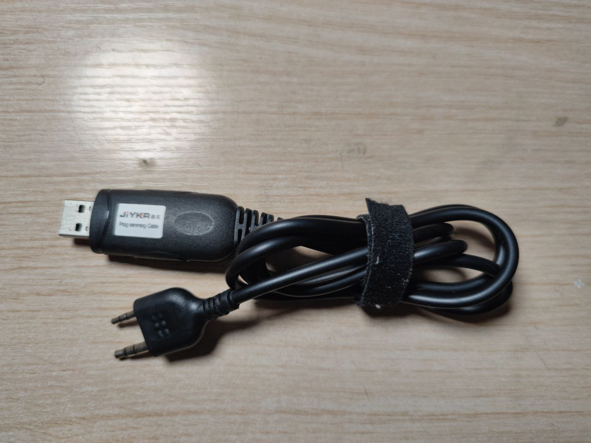
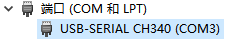
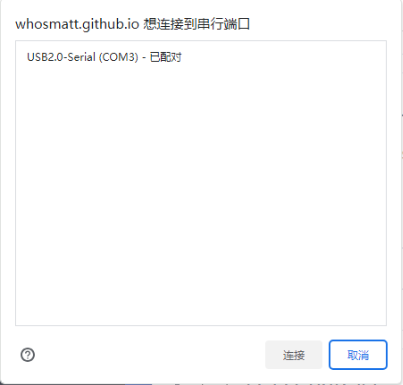
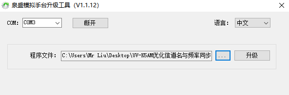

+++
title = "泉盛UV-K5刷固件教程"
date = 2023-11-25
description = "本文详细介绍了新一代入门神机泉盛UV-K5手台的刷机教程，包含固件推荐、所需配件，以及Web端自定义固件和本地软件刷机的完整步骤与功能参数详解。"
categories = ["无线电", "教程"]
tags = ["泉盛UV-K5", "对讲机刷机", "手台", "自定义固件", "Quansheng"]
+++

继宝峰UV-5R一代神机之后，以低价、高可玩性为卖点的泉盛UV-K5成为新一代入门神机，在全球范围内大卖，为无数爱好者提供了一个新的入门选择。那么作为一名刷机佬，怎么能不尝试将其刷机呢？

## 固件推荐

* **固件合集：** [链接]（此仓库内包含各大热门固件的链接，如果想手动刷入可以选择此方式）
* **官方固件：** [链接]（建议验机时刷入官方固件，避免因第三方固件导致射频性能下降，验机出问题）
* **Web自定义固件（推荐方案）：**
    * 英文版（优先使用）
    * 中文版（更新较慢，如遇无法刷入请用英文版）
    * 项目地址

## 刷机所需配件

1. K头写频线，10多块一条，尽量买 CH340 的，Win10可以免驱

2. 设备本体（UV-K5 或 K6 均可）
3. 电脑一台

## 刷机教程

### Web自定义固件刷机方法（推荐）

#### 第一阶段：设备连接与准备
1. **物理连接**：使用 K头写频线将电脑与手台连接。连接好后，写频线亮起绿灯，电脑“设备管理器”中出现对应的串口。

2. **进入刷机模式**：按住手台的 **PTT** 按键不放，同时开机。此时写频线的指示灯应该开始闪烁。
3. **打开刷机网页**：访问 Web 刷机网站（优先使用英文版），若弹出窗口申请页面，请允许，根据需求勾选以下定制模块。

#### 第二阶段：固件模块配置（可选项目）

**一、 附加应用 (APP)** - *通常只能选择一个*
* **APP 1（推荐）**：显示 RSSI 读数、S表和电池电压。
* **APP 2（不推荐）**：显示 RSSI 读数、图形（比前者少个S表）。
* **APP 3（不推荐）**：基础频谱图。手电筒键启动；按 `上/下` 调整中心频率；`8/2` 缩放；`1/7` 调分辨率；`PTT/EXIT` 退出（需进菜单刷新屏幕）。
* **APP 4（推荐）**：高级频谱图。
  * **启动**：将 SQL 设为 0 或打开监听后，按 **手电筒键** 启动。
  * **操作**：`上/下` 调整频率 | `1/7` 灵敏度 | `2/8` 频率步进 | `9/3` 缩放 | `长按 */F` 降噪等级 | `5` 背光控制 | `0` 忽略频率 | `EXIT` 退出。
* **APP 5（按需选择）**：消息功能 (数字传送)。按 **手电筒键** 启动，支持 T9 输入；`MENU` 发送；`EXIT` 清除或退出；`*` 确认输入。
* **APP 6（玩具）**：乒乓球小游戏，开机自动启动。

**二、 界面与显示定制 (UI & Display)**
* **Battery icon（推荐）**：更换更好看的电池图标。
* **Custom Bootscreen（自定义开机画面）**：更换开机图案（显示两秒，覆盖系统设置），内置 Troll Face、Quansheng Logo、UVMOD Banner、NOKIA Logo，支持自动裁切黑边。
* **Skip Bootscreen（跳过开机屏）**：开机立即进入主屏幕。
* **Font（自定义字体）**：可选 **VCR 字体（推荐，替换大数字）** 或 Futuristic 字体。
* **Negative Display（反色屏幕）**：反转屏幕黑白颜色。
* **Backlight Duration（推荐）**：双倍背光持续时间。设置值乘以 2，如设为 5 则实际亮 10 秒。
* **LCD Contrast（屏幕对比度）**：一般默认即可，足够清晰。

**三、 射频与功能增强 (RF & Features)**
* **Disable Freq Copy Timeout（推荐）**：禁用扫频超时。防止扫频和 CTCSS 解码因超时失败，允许其无限期运行直到找到信号。
* **Increase Mic Gain（增加麦克风增益）**：提供额外提升，使麦克风拾音更灵敏。
* **Roger Beep（蛙叫尾音）**：改变发射结束音调（类似 Mototrbo 尾音），最大支持 6347 Hz。
* **Custom Frequency Ranges（自定义频率范围）**：支持突破原厂限制。简单模式可将频段1最低解锁至 18 MHz，频段7最高至 1300 MHz（芯片物理极限）。
* **AM RX on all Bands（推荐）**：为所有频段启用 AM 接收（原厂固件仅限 F2 频段）。
* **FM Radio Frequencies（修改 FM 频段）**：建议选 `64 - 108 MHz`，全覆盖 FM 波段。
* **常规参数**：`Frequency Steps` (步进)、`NOAA Frequencies` (天气频率)、`AIR COPY Frequency` (空中复制频率) 一般保持默认即可。

**四、 高级/慎用功能 (Warning)**
* **Disable TX completely（完全禁用发射）**：在所有频率上禁发，将手台变成纯接收机（适合纯听友）。
* **Menu strings（菜单文本修改）**：修改菜单的底层 JSON 文本，受字符大小限制，新手勿动。
* **Enable SWD Port（启用 SWD 端口）**：开启硬件调试模式。需要拆机飞线焊接到主板并连接专用硬件。不懂勿开！

#### 第三阶段：完成刷写

1. 选好想要的功能后，即可点击右侧的 **Patch Firmware**，如没有错误会显示 `Finished applying mods`，并显示所占用的内存总量。
2. 此时点击 **Flash Directly** 一键刷写固件。如果弹出选择串口的界面，点击写频线对应的串口即可；若不知道对应串口号，把写频线拔下来重新插，消失再出现的即是应选择的串口。
3. 刷写过程中 LED 灯会不停闪烁，完成后会自动重启，进入主界面。

### 使用本地软件刷机

1. 刷机软件名为“泉盛模拟手台升级工具”，可以无脑安装，没啥注意事项。
2. 用写频线连接手台和电脑，长按 **PTT** 键进入刷机模式，此时屏幕没有显示，LED灯应亮起。
3. 打开泉盛模拟手台升级工具，选择串口，点击连接，选择固件（`.bin` 格式）。此时升级按钮应该为可选状态，点击即开始刷写，刷写完成后自动重启。

## 相关资料

* **GitHub 固件合集：** https://github.com/amnemonic/Quansheng_UV-K5_Firmware
* **中文版一键下载链接：** https://uvmod.xanyi.eu.org/fw/uvk5updater.zip
* **官网链接：** http://www.qsfj.com/support/downloads/3002
* **官方刷机软件一键下载链接：** http://files.qsfj.com/UV-K5写频软件.zip
* **B站UP“抬头拍飞机”分享的固件合集：** https://wwdj.lanzout.com/b0a6l8r7a （密码: K5NB）

---