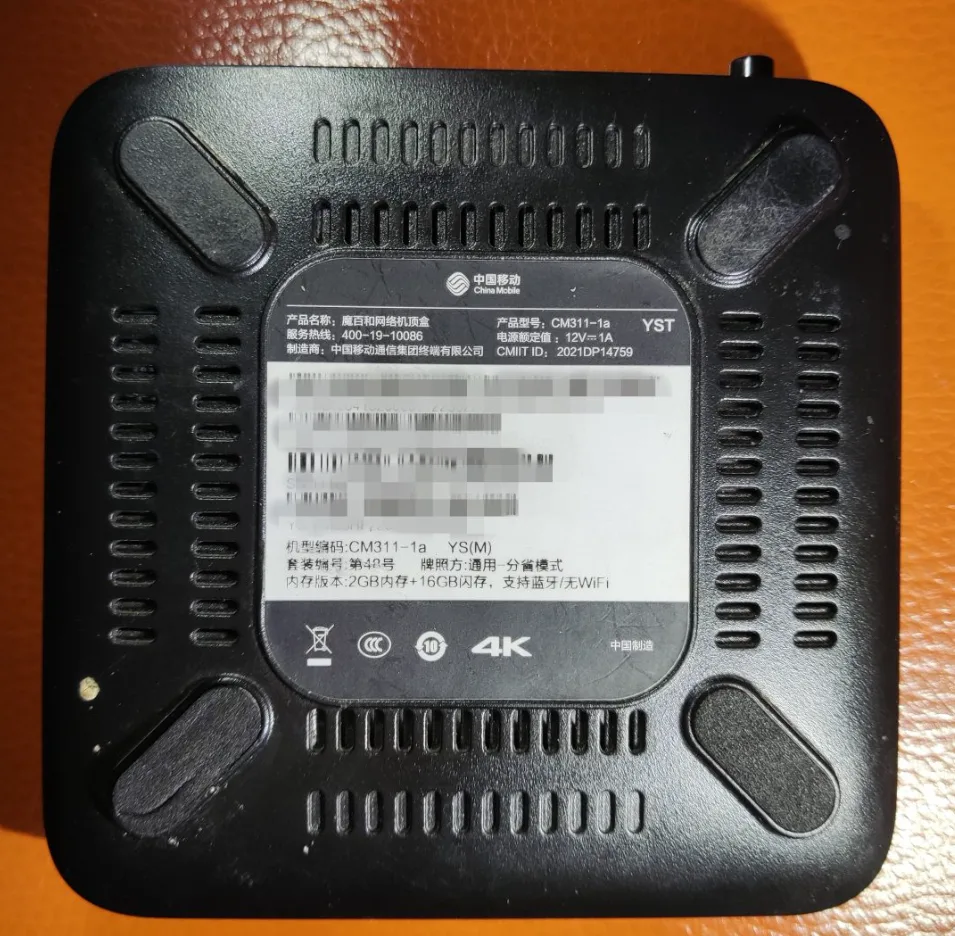
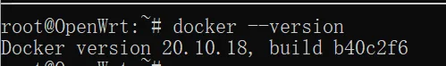
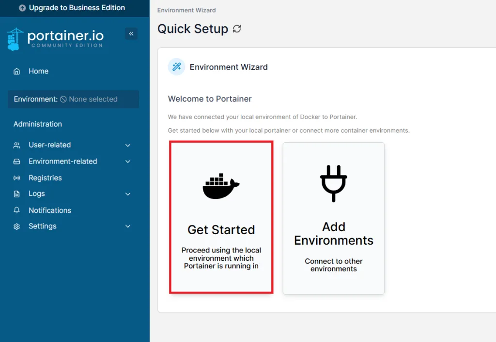
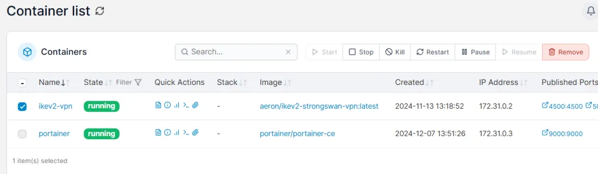
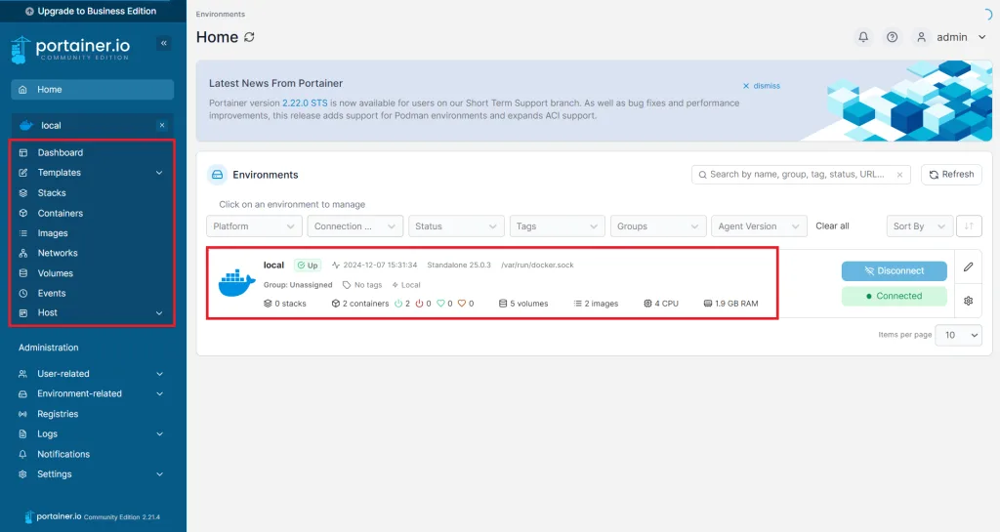
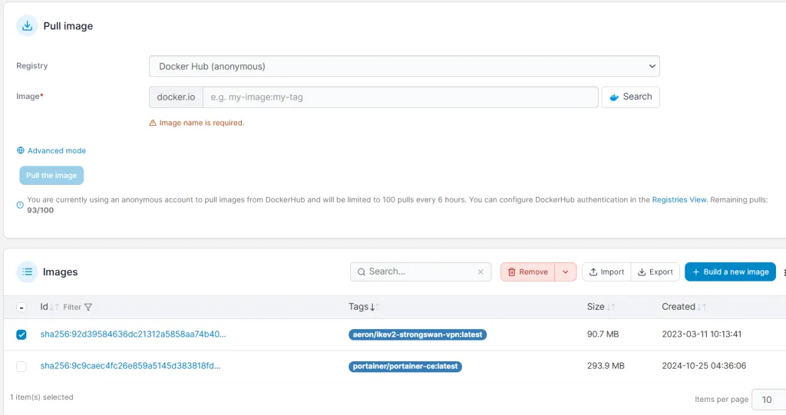
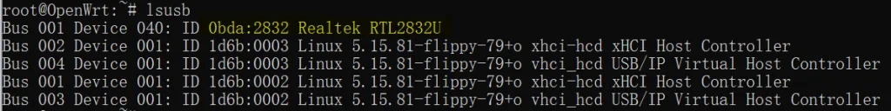
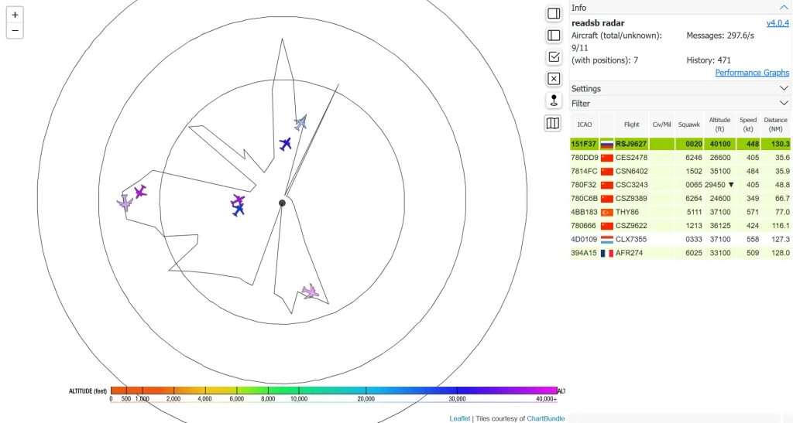
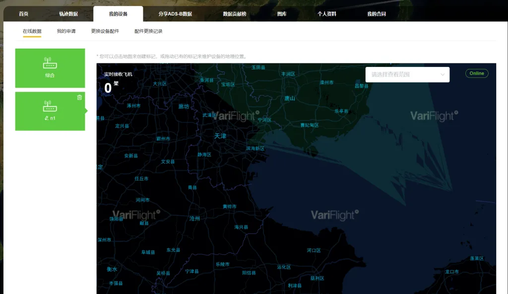
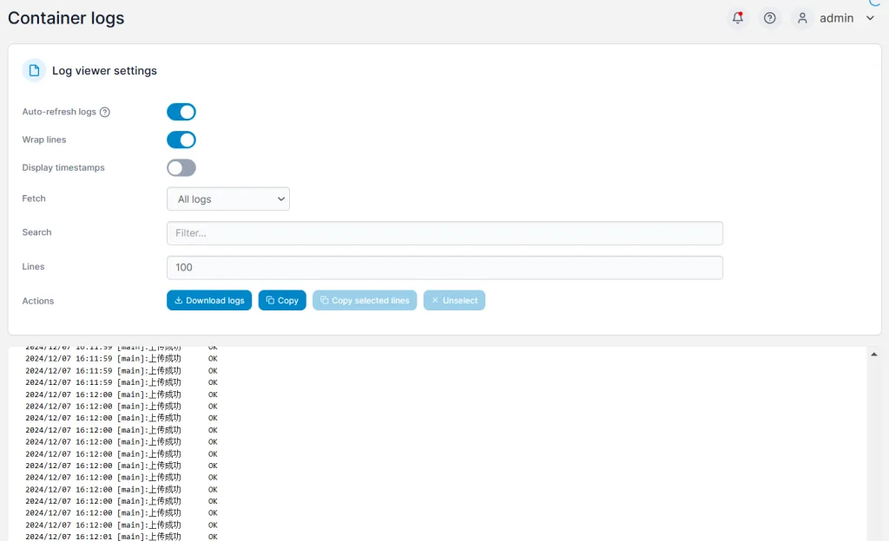

+++
title = "SDR软件无线电之ADS-B信号接收与上传至飞常准教程"
date = 2024-12-17
description = "全docker方案：使用Readsb-protobuf + 飞常准 Feeyo ADS-B 上传实例"
categories = ["无线电", "教程"]
tags = ["ADS-B", "SDR", "飞常准", "Docker"]
+++


警告：请不要尝试将相关电波数据传送至FR24、RadarBox、FA等境外平台，这将严重违反无线电管理条例以及国家安全法！



本文采取**全Docker方案**，所用镜像均为开源镜像。若无法连接Docker Hub或GitHub，请自行解决网络问题。


## 第一步：硬件选择

### 1. 上传设备

请确保你的硬件可以**正常工作**，并**正确安装了Linux系统**。安装Linux的步骤根据设备不同而异，请自行查找相关教程。

我使用的是中国移动的和家亲CM311-1a电视盒子，DC12V供电，支持网线连接。这类电视盒子保有量大，价格低廉，在闲鱼上五六十元就可以买到一个使用晶晨S905系列芯片的电视盒子，性价比很高。



如果对电视盒子的稳定性不太放心，推荐使用树莓派、香橙派等开发板。除非你所处的位置飞机流量很大，数据量庞大，CPU性能不低于树莓派2B就足够了。实在不行，可以少开几个Docker容器。当然，使用X86架构的工控机或退役电脑也是不错的选择，只是功耗较高。

### 2. SDR设备

我使用的是飞常准定制的有滤波放大器的SDR设备。当然，使用RTL2832U小蓝棒配合DIY[滤波放大器](https://oshwhub.com/Zy143L/ads-b-1090)也能取得不错的效果。下文中使用的信号解码容器支持RTLSDR、BladeRF、Modes-Beast和GNS5894等多种方案。

### 3. 天线

我使用的是华鸿定制的1090MHz玻璃钢天线，从阿里巴巴找工厂加微信订购，价格约120元一根。

你也可以使用最便宜的吸盘天线，用钳子将金属棒剪至6.75cm长度，效果也不错。

## 第二步：连接设备

将天线、SDR设备和控制设备按顺序连接。注意ADS-B信号频率为1090MHz，所以天线尽量放置在**窗外**或**楼顶**，并做好**防水防雷**措施。

## 第三步：安装Docker环境

建议使用Docker官方脚本进行傻瓜式安装：

```sh
curl -fsSL https://get.docker.com | bash -s docker
```

你可以在此命令后附加`--mirror`参数设置镜像源，以提高国内服务器下载Docker的速度：

```sh
curl -fsSL https://get.docker.com | bash -s docker --mirror Aliyun
```

安装成功后，可以通过`docker --version`命令查看Docker版本信息。



## 第四步：安装各类Docker容器

### 1. 安装Portainer-CE

[Portainer-CE](https://docs.portainer.io/start/install-ce)是一个用于Docker可视化管理的工具，推荐优先安装。

运行以下命令：

```sh
docker run -d -p 9000:9000 --name portainer --restart always -v /var/run/docker.sock:/var/run/docker.sock portainer/portainer-ce
```

安装完成后，打开浏览器访问`http://设备IP:9000`，即可打开Portainer-CE的管理界面。首次启动需要设置用户名和密码，连接环境时选择本地环境即可。



此时，你可以在主页看到本地主机，左侧边栏可以管理容器（containers）和镜像（images）。





### 2. 安装Readsb-protobuf

[Readsb-protobuf](https://github.com/sdr-enthusiasts/docker-readsb-protobuf)用于解码ADS-B信号。

首先，通过SSH登录到设备，确认可以通过`lsusb`等命令识别到SDR设备。若无法识别，可以尝试重新插拔几次。

然后，运行以下命令安装（首次运行会自动下载镜像，时间较长，请耐心等待）：

```sh
docker volume create readsbpb_rrd
docker volume create readsbpb_autogain
docker run \
-d \
-it \
--restart=always \
--name readsb \
--hostname readsb \
--device /dev/bus/usb:/dev/bus/usb \
--net=host \
-e TZ=Asia/Shanghai \
-e READSB_DCFILTER=true \
-e READSB_DEVICE_TYPE=rtlsdr \
-e READSB_FIX=true \
-e READSB_GAIN=autogain \
-e READSB_LAT=<纬度> \
-e READSB_LON=<经度> \
-e READSB_MODEAC=true \
-e READSB_RX_LOCATION_ACCURACY=2 \
-e READSB_STATS_RANGE=true \
-e READSB_NET_ENABLE=true \
-v readsbpb_autogain:/run/autogain \
-v readsbpb_rrd:/run/collectd \
--tmpfs=/run:exec,size=64M \
--tmpfs=/var/log:size=32M \
ghcr.io/sdr-enthusiasts/docker-readsb-protobuf:latest
```

**注意**：将`<纬度>`和`<经度>`替换为你设备所在位置的准确经纬度。建议使用谷歌地图确定，避免使用火星坐标系带来的偏移。

命令运行成功后，打开浏览器访问`http://设备IP:8080`，就可以看到飞机信息。如果地图无法加载，是因为软件默认使用OpenStreetMap的开源地图，国内网络可能受限。



### 3. 安装飞常准上传Docker

[飞常准上传Docker](https://github.com/dextercai/feeyo-adsb-golang)用于将解码数据上传至飞常准平台。项目主页有详细教程，可参考此处摘抄。

推荐新手使用命令行传递参数：

```sh
docker run -d \
--restart=always \
--name feeyo-feed \
--net host \
dextercai/feeyo-adsb-golang:latest /app/feeyo-adsb-golang \
-use-file=false -feeyo-url=https://adsb.feeyo.com/adsb/ReceiveCompressADSB.php \
-ip=127.0.0.1 -port=30003 -uuid=你的UUID
```



**注意**：将"你的UUID"替换为自己的UUID。若没有UUID，可以使用该脚本作者制作的[UUID生成网站](https://feeyo-uuid.dextercai.com/)生成。请牢记并保存该UUID。

至此，已完成最基本的ADS-B信号解码和上传过程。打开浏览器访问`https://flightadsb.variflight.com/device/index/你的UUID`，可以查看飞常准采纳的飞机数量和位置信息。如需监控容器运行状态，可以在Portainer-CE中查看容器日志。







---