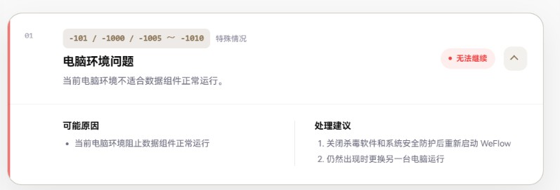

+++
title = "WeFlow 报错修复教程：-101 到期检查与 -105 状态不一致"
date = 2026-10-08
description = "记录 WeFlow 6.3.1 的 -101 到期修复与后续 -105 排查，提供 DLL 替换方法和无需 Codex 的状态同步脚本，并说明适用范围、备份与验证步骤。"
tags = ["WeFlow", "Windows", "故障排查", "DLL"]

[[resources]]
name = "feature"
src = "weflow.jpg"
+++

2026 年 10 月，我先遇到了 WeFlow 的 `-101`，修复组件期限后，又在正常退出、重新打开时遇到 `-105`。两次报错的直接原因不同，处理方法也不同。

**本文提供的 DLL 和脚本都不需要 Codex。** `-101` 可以按第一节替换指定 DLL；如果随后出现 `-105`，先看第二节，只有符合条件的状态副本不一致才适合用同步脚本处理。

本次已验证正常启动和托盘退出后重新启动；聊天读取、会话列表及导出仍需按自己的账号逐项测试。

## 1. 快速修复 -101：下载 DLL 后替换

### 适用范围与下载

适用于 **Windows x64、WeFlow 6.3.1**，并且原始 `wcdb_api.dll` 的 SHA-256 必须为：

```text
86d863ef53216d58fc312bf5eaf95ff10161ec828501e477c6a42f1f6b74d3ce
```

[下载修复版 wcdb_api.dll](wcdb_api.dll)（1,651,712 字节，约 1.58 MiB）。

修复版 SHA-256：

```text
0193625007c14fd7f95e882750e78fb9e47267a5a743dbaf95601aa373a23992
```

补丁将六处期限延至北京时间 **2037 年 10 月 1 日 00:00:00**。这是本机组件的临时修复方案，新期限仍然存在。

版本号相同不代表 DLL 相同。原始哈希不同、软件已经更新，或系统架构不同，均不要直接套用这份附件。

### 替换步骤

1. 通过托盘菜单完全退出 WeFlow，在任务管理器中确认后台没有 WeFlow 进程。
2. 打开安装目录中的 `resources\resources\wcdb\win32\x64\`。默认完整路径为：

   ```text
   C:\Program Files\WeFlow\resources\resources\wcdb\win32\x64\
   ```
3. 核对原始 DLL 哈希。可以在 PowerShell 中执行：

   ```powershell
   Get-FileHash -Algorithm SHA256 -LiteralPath 'C:\Program Files\WeFlow\resources\resources\wcdb\win32\x64\wcdb_api.dll'
   ```
4. 将原文件重命名为 `wcdb_api.dll.bak`，保留备份。如果已有同名备份，先核对内容，另存一份，不要直接覆盖。
5. 下载附件，核对修复版哈希，将它以 `wcdb_api.dll` 的文件名放入同一目录。写入 `Program Files` 时按 Windows 提示授予管理员权限。
6. 正常打开 WeFlow，再通过托盘退出并重新打开一次。按自己的账号配置测试数据库连接、会话列表、聊天读取和导出。

如果现有 DLL 已经是上面的修复版哈希，无需再次替换，也不要把它当作原始备份。

需要撤回 DLL 补丁时，完全退出 WeFlow，把修复版移出安装目录，再将原始备份恢复为 `wcdb_api.dll`，核对其哈希。恢复原件也会恢复原有期限。

## 2. 替换后出现 -105：先判断是否为状态副本不一致

### 这次 -105 的原因

本机出现的提示是：

> 离线防回拨状态损坏或无法安全保存，请检查当前用户目录权限（错误码：-105）

这条提示不能直接证明是权限问题。`-105` 涉及防回拨状态的加载、校验或保存，不能只凭错误码确定根因。

本机这份组件维护了三份加密状态：

- `%LOCALAPPDATA%\WeFlow\State\native-anchor-v7-*.bin`
- `%LOCALAPPDATA%\WeFlow\Runtime\anchor-v7-*.bin`
- 用户注册表 `Software\WeFlow\Runtime` 中对应的 `AnchorV7-*` 条目

真实应用诊断确认，三份记录都能读取、解密并通过组件校验，但两份文件中的时间和计数已经更新，WeFlow 实际注册表视图中的记录仍较旧，因此一致性检查失败。

排查过程中还有一个容易误判的地方：**Codex 检查环境看到的注册表值，与 WeFlow 实际读到的值不同。** 外部检查显示三份副本一致，并不能证明真实应用使用的三份副本一致。最后通过 WeFlow 已持有的用户注册表根句柄查询，才确认旧记录。

这一差异已经实测确认；具体 Windows 隔离机制尚未确定，不能简单归因于某一种 UAC、32/64 位或 MSIX 虚拟化。

### 无需 Codex 的处理方法

[下载状态同步脚本 weflow_state_sync.py](weflow_state_sync.py)。

该脚本使用 Python 标准库，无需 AI 服务、账号或第三方 Python 包。它会通过正在运行的 WeFlow 查询实际注册表视图，而不是直接使用脚本自己看到的 `HKCU`。

**只适用于第一节指定的修复版 DLL，以及“两份文件完全相同、同设备同构建、注册表记录较旧”的情况。** 默认只检查，只有显式加上 `--apply` 才会备份后同步一个注册表条目。

1. 从 [Python 官方 Windows 下载页](https://www.python.org/downloads/windows/) 安装 **64 位 Python**。脚本已在 Python 3.12 x64 上验证。
2. 把脚本保存到独立的本机目录，例如 `C:\WeFlow-repair`，确认文件名为 `weflow_state_sync.py`，没有多出 `.txt`。不要放在准备上传博客的目录中。
3. 从开始菜单或桌面快捷方式正常打开 WeFlow，**保留 -105 报错窗口和后台进程**。这一步需要 WeFlow 的运行中句柄，因此先不要退出。
4. 用同一 Windows 账号打开 PowerShell，进入保存脚本的目录，执行只读检查：

   ```powershell
   Set-Location -LiteralPath 'C:\WeFlow-repair'
   py -3 .\weflow_state_sync.py --check
   ```

   如果没有 `py` 命令，可用已安装的 64 位 `python` 命令代替。遇到进程访问权限问题，可在同一账号下以管理员身份打开 PowerShell后重试；不要换成其他 Windows 用户。
5. 只有输出显示 **“注册表副本较旧，可备份后同步”**，且 WeFlow 状态尚未加载成功时，才执行：

   ```powershell
   py -3 .\weflow_state_sync.py --apply
   ```
6. 脚本会把两份文件和原注册表加密值备份到脚本旁的 `weflow-state-backups` 目录，再同步对应条目，并读回核对。完成后，通过托盘完全退出 WeFlow，再重新打开；正常后再退出、重开一次。

脚本不会加载或调用 DLL 自检，不会读取设备根密钥，也不会修改 DLL、系统时间、账号配置或微信数据库。它检查 DPAPI 解密、记录格式、设备/构建匹配及时间和计数不倒退；**没有独立复现组件的 HMAC 校验，最终恢复结果必须由真实 WeFlow 启动确认。**

如果输出“两份文件不一致”“设备/构建不匹配”“DPAPI 解密失败”“DLL 哈希不匹配”，或“实际三份副本一致”，就不属于本脚本可以直接处理的情况。不要强行修改脚本、删除状态文件或反复调用 DLL 自检。

同步后仍报错时，保留日志和备份继续排查。**不要把加密状态备份上传博客，也不要随意把旧注册表值单独恢复到已更新的文件旁边**，这样可能重新制造不一致。

附件的备份、拒绝倒退、并发变化保护等逻辑已通过测试，并在本机正常 WeFlow 上完成只读检查。原故障使用同一注册表句柄同步方法恢复；通用附件没有在第二台故障电脑上验证，不保证解决所有 `-105`。

## 3. 故障现象：10 月之后突然报 -101

2026 年 10 月 1 日之后，WeFlow 出现了 `-101`。这次排查用的是 Windows x64 下的 WeFlow 6.3.1，故障截图如下：



最后定位到了安装目录中的 `wcdb_api.dll`：这份原生组件带有日期检查，截止时间为北京时间 **2026 年 10 月 1 日 00:00:00**。

到期原因和后续 `-105` 属于不同问题。替换期限补丁并不会自动修复已有的状态副本不一致。

## 4. 原因排查：DLL 里不止一处日期检查

排查参考了 [hicccc77/WeFlow#1222](https://github.com/hicccc77/WeFlow/issues/1222)。讨论中分析的是 Windows x64 下 WeFlow 5.0.0 的另一份 DLL：最初报 `-101`，仅处理第一处检查后又遇到 `-1000`。这提示我不能只处理最先触发的检查，也不能直接照搬其他版本的修改地址。

我先核对本机文件：版本为 6.3.1，大小为 1,651,712 字节，原始 SHA-256 与第一节一致。后续分析和修改都以这份文件为准。

对原始 DLL 的历史诊断结果是：

```text
POLICY -101
```

继续检查后，在这份 DLL 中找到了六处日期检查。逐一测试时间边界，最后能够通过的时刻均为 Unix 时间 `1790783999`，即北京时间 **2026 年 9 月 30 日 23:59:59**；下一秒进入到期状态。

这与故障日期吻合。本机直接复现的是 `-101`；issue 中的 `-1000` 是其他版本的排查线索，不能当作本机已经复现的结果。

**下面的组件诊断输出属于历史分析记录。独立版本自检会更新持久化状态，普通读者无需运行它；日常验收使用正常应用启动和日志。**

## 5. DLL 修改：把六处期限一起延后

六处排他截止时间从 `1790784000` 改为 `2137939200`，即北京时间 **2037 年 10 月 1 日 00:00:00**。新值仍小于 `0x80000000`，没有超出有符号 32 位整数的正数范围。

补丁在六处加载常量的位置插入跳转，转到原有代码节末尾的空白区域：先执行原来的常量加载，仅遇到旧期限时才换成新期限，然后执行原来的后续指令，最后返回原位置。

原来的日期比较仍保留，只改变截止时间。补丁也保存和恢复标志寄存器，使其他值继续按原路径处理。六处修改位置如下；RVA 是相对虚拟地址，与磁盘文件偏移不同：

| 常量加载入口 RVA | 文件偏移 | 新增代码 RVA |
| --- | --- | --- |
| 0x11ea59 | 0x11de59 | 0x149120 |
| 0x122b8a | 0x121f8a | 0x149140 |
| 0x126b1c | 0x125f1c | 0x149160 |
| 0x1294f7 | 0x1288f7 | 0x149180 |
| 0x12e7aa | 0x12dbaa | 0x1491a0 |
| 0x13597a | 0x134d7a | 0x1491c0 |

DLL 还有完整性检查。因此代码修改后，按组件原有方式重新计算参与校验的节头字段和节内容，更新 RVA `0x1897d0` 的内部摘要。这是组件自身的完整性摘要，不是厂商数字签名。

修复版与原版共有 **237 个字节不同**。新增代码利用了已有填充空间，只扩展对应可执行节的虚拟大小；文件长度仍为 1,651,712 字节，`SizeOfImage`、导出名称和导出地址均保持不变。

这些地址只对应本文指定原件。软件更新后，必须重新确认哈希和兼容性，不能强行用旧 DLL 覆盖新组件。

## 6. 修复后测试与方法纠正

2026 年 10 月 8 日，我重新核对了安装目录中的 DLL 和两份原件备份。历史组件诊断结果为：原版仍返回 `POLICY -101`，修复版返回应用要求的版本值：

```text
POLICY 1464206081
DIAG 0x111c70 1
DIAG 0x1124b0 1
DIAG 0x1135e0 1
CONTEXT 0 1
```

六个日期函数的最后通过时刻均变为 `2137939199`，即北京时间 **2037 年 9 月 30 日 23:59:59**。完整性和上下文检查也通过。

早期应用测试曾停在账号配置环节：

```json
{"ready": true, "connect": {"success": false, "error": "请先在设置页面配置微信ID"}}
```

当时微信 ID 和解密密钥尚未配置，因此这条历史记录不能证明真实数据库读取正常。

后续 `-105` 修复完成后，临时诊断 DLL 已全部移除，安装文件恢复为第一节的到期修复补丁。北京时间 **19:02:36、19:03:05** 的两次启动日志均出现 `native protection ok`；正常打开、托盘退出再打开均正常，实际两份文件和 WeFlow 注册表视图中的摘要一致。

此次排查也纠正了一个方法上的错误：**DLL 的版本自检不是只读操作，它会更新防回拨状态。** 从不同注册表视图运行自检，可能使真实文件与应用注册表副本分叉。后续不能把工具环境的单次诊断成功，当作用户正常退出、重启已经稳定的证据。

目前已经验证的是期限延后、组件校验及两次正常启动/退出重启。会话列表、聊天读取和导出仍需按自己的账号实际测试；本文不宣称所有功能已经永久恢复。
